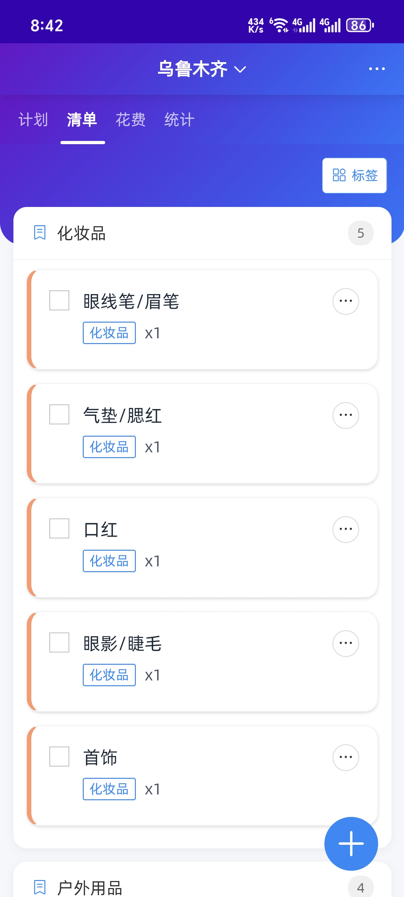

# 🧭 旅行助手 | Travel Plan

**一款专业的旅行规划与记录工具**

## ⏬ 下载地址

在项目 releases 中进行下载

## ✨ 核心功能

### 📅 行程规划

- 创建个性化旅行计划

- 设置每日行程安排

- 添加重要地点和活动提醒(未完成)

### 🧳 行李管理

- 智能生成行李清单模板(未完成)
- 自定义物品分类（衣物、电子设备、洗漱用品等）

- 打包状态实时追踪

### 💰 费用追踪

- 记录各类旅行支出（交通、住宿、餐饮等）

- 支持多币种自动换算(未完成)
- 生成费用统计报表

### 📷 旅行记忆

- 按时间线记录旅程点滴

- 添加照片和文字备注(未完成)

- 生成专属旅行日记(未完成)

## 🚀 快速开始

1. 创建新的旅行
2. 添加行程计划和清单
3. 开始规划你的完美旅程！

> "让每一次旅行都成为美好的回忆"
